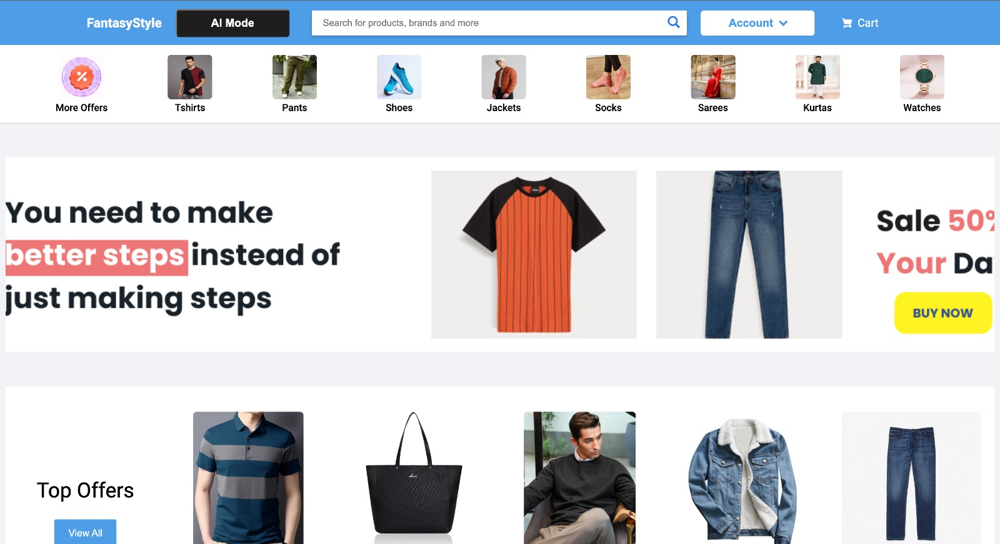

# Fashion Genie

## Conceptual Discourse: Vision and Purpose

> In this repository, we address various challenges in the fashion domain through innovative solutions powered by AI. Our goal is to enhance the fashion shopping experience for users by leveraging cutting-edge technologies. Here's an overview of the key problems we tackle and their corresponding solutions:

1. **Visual Search**: Employs a Generative AI Text-to-Image model to seamlessly transform textual inputs into virtual try-on images.
2. **Conversational Fashion Chatbot** - _Mr Genie_ : Chatbot that engages users in discussions about fashion trends, preferences, and outfit ideas
3. **Recommendation Engine for Similar Products**: Recommends similar products to users based on their preferences and past purchases
4. **Real-Time Fashion Trends Analysis**: Provides real-time insights into the latest fashion trends and styles

    ```mermaid
    ---
    title: Fashion Genie Architecture
    ---
    stateDiagram-v2
        User --> LLM : Prompt
        User --> Diffusion : Images
        User --> Details : History & User Data
        Details --> RecSys
        LLM --> RecSys
        Diffusion --> RecSys
        note right of RecSys : Products
    ```

## Technological Paradigm

<div style="display: flex; justify-content: center; align-items: center;">
    
    
    
    
    
    
    
</div>

## Orchestrated Scenarios: Exploring FashionGenie's Capabilities

1. **Personalized Outfit Discovery:**
    Elevated Elegance through Personalized Discovery

2. **One model fits all:**
    Singular Style, Tailored to All

3. **Staying On-Trend:**
    Navigating Trends with Flair

4. **Elevated Shopping Experience:**
    Crafting the Shopping Experience

5. **Effortless Matching:**
    Harmonious Ensemble in a Glance

6. **Fashion Advice for All Ages:**
    Beyond Generational Grace

7. **Browsing History-Informed Recommendations:**
    A Symphony of Histories, A Cadence of Discovery

8. **Enhanced In-Store Experience:**
    Bringing Digital Mirage to Retail Reality

9. **User-Curated Wishlist:**
    Sculpting Desires: A User-Curated Odyssey

10. **Social Media Sharing:**
     Ensemble Echoes in Cyberspace: Sharing Stories

## Visual Artistry: Evolving Creations and Training Insights

### Training Images

 |  |  | 
:---: | :---: | :---:
Image 1 | Image 2 | Image 3 

### Generated Images

 |  |  | 
:---: | :---: | :---: | :---:
Image 1 | Image 2 | Image 3 | Image 4

### Recommended Images on Image 3

 |  |  | 
:---: | :---: | :---: | :---:
Image 1 | Image 2 | Image 3 | Image 4

## User Interface



## Project Organization

```

├── README.md               <- The top-level README for developers.
├── requirements
│   └── env.yml             <- The conda environment file for reproducing the
├── data                    <- Training and generated data is kept in this folder
├── models                  <- Trained and serialized models, model predictions,
│                              or model summaries.
├── notebooks               <- Jupyter notebooks.
├── scripts                 <- Analysis and production scripts which import the
build.
├── web                     <- Web app files(HTML, CSS, JS)
└── src                     <- Python files containing the architecture of the
                                project.
```
